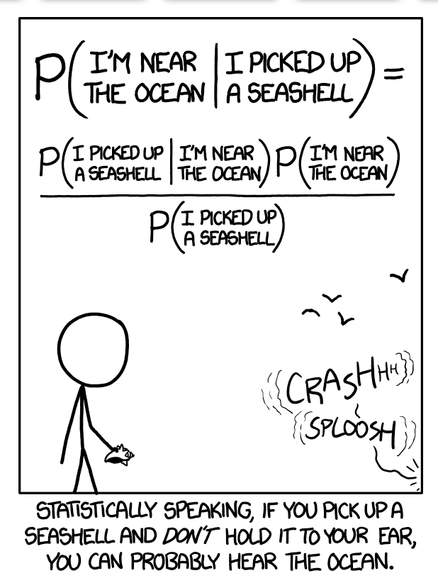

  
# Preface

Hello! Welcome to the bookdown of our MATH 454 Bayesian Statistics Project!

We had a lot of fun doing this project, and you are always welcome to come back at any point for our progress!

Credit to xkcd: https://xkcd.com/1236/

